# pulceo-misc

## Quick Access SummerSoc 2025

Publication: **API-driven Task Scheduling and Offloading with PULCEO: An Extension**  
Presentation: 🪧 [API-driven Task Scheduling and Offloading with PULCEO: An Extension (online)](https://spboehm.github.io/pulceo-misc/presentations/summersoc2025), [(PDF version)](https://github.com/spboehm/pulceo-misc/blob/main/docs/presentations/summersoc2025/summersoc2025.pdf)  
Video: 📹 [API-driven Task Scheduling and Offloading with PULCEO: An Extension, Sebastian Böhm, SummerSOC 2025](https://www.youtube.com/watch?v=epEcU7aFFLk)  
Poster: 📃 [API-driven Task Scheduling and Offloading with PULCEO: An Extension](https://github.com/spboehm/pulceo-misc/blob/main/docs/presentations/summersoc2025/summersoc2025-poster.pdf)  
- Raw data: [pulceo-data-analytics/raw/summersoc2025](https://github.com/spboehm/pulceo-misc/tree/main/pulceo-data-analytics/raw/summersoc2025)
- [PULCEO orchestration reports](https://spboehm.github.io/pulceo-misc/reports/): [Orchestration report](https://spboehm.github.io/pulceo-misc/reports/summersoc2025/)
- For all experiments, the following versions have been used:
  - pulceo-resource-manager: **v1.3.0**
  - pulceo-monitoring-service: **v1.3.1**
  - pulceo-service-manager: **v1.3.0**
  - pulceo-node-agent: **v1.3.0**

## Quick Access SOSE 2024

Publication: **Towards an API-driven Approach for Universal and Lightweight Cloud-Edge Orchestration**

- Semi-structured literature review for obtaining the domain model: [PULCEO: Structured Literature Review Source Repository](https://spboehm.github.io/pulceo-misc/)
- Documentation of RESTful API requests: [examples/api-usage/sose2024](https://github.com/spboehm/pulceo-misc/tree/main/examples/api-usage/sose2024)
- Raw data: [pulceo-data-analytics/raw/sose2024-prod](https://github.com/spboehm/pulceo-misc/tree/main/pulceo-data-analytics/raw/sose2024-prod)
- [PULCEO orchestration reports](https://spboehm.github.io/pulceo-misc/reports/): [Orchestration report](https://spboehm.github.io/pulceo-misc/reports/sose2024-prod/)
- For all experiments, the following versions have been used:
  - pulceo-resource-manager: **v1.2.0**
  - pulceo-monitoring-service: **v1.2.1**
  - pulceo-service-manager: v1.0.0
  - pulceo-node-agent: v1.0.0

## Quick Access SummerSOC 2024

Publication: **API-driven Cloud-Edge Orchestration with PULCEO: A Proof of Concept**  
Presentation: 🪧 [API-driven Cloud-Edge Orchestration with PULCEO: A Proof of Concept (online)](https://spboehm.github.io/pulceo-misc/presentations/summersoc2024), [(PDF version)](https://github.com/spboehm/pulceo-misc/blob/main/docs/presentations/summersoc2024/summersoc2024.pdf)  
Video: 📹 [API-driven Cloud-Edge Orchestration with PULCEO: A Proof of Concept, Sebastian Böhm, SummerSOC 2024](https://www.youtube.com/watch?v=XfjWggOLIBE)  
Poster: 📃 [API-driven Cloud-Edge Orchestration with PULCEO: A Proof of Concept](https://github.com/spboehm/pulceo-misc/blob/main/docs/presentations/summersoc2024/summersoc2024-poster.pdf)  

The experiment had to phases, therefore the raw data and the orchestration reports each contain `idle` and `load`.
For `idle`, we did not apply workloads and load experiments to the platform and analyzed the `idle` behavior of all components.
For `load`, we deployed a few instances of the [edge-iot-simulator](https://github.com/spboehm/edge-iot-simulator).

- Semi-structured literature review for obtaining the domain model: [PULCEO: Structured Literature Review Source Repository](https://spboehm.github.io/pulceo-misc/)
- Documentation of RESTful API requests: [examples/api-usage/summersoc2024](https://github.com/spboehm/pulceo-misc/tree/main/examples/api-usage/summersoc2024)
- Raw data:
  - Idle: [pulceo-data-analytics/raw/summersoc2024-prod-idle](https://github.com/spboehm/pulceo-misc/tree/main/pulceo-data-analytics/raw/summersoc2024-prod-idle)
  - Load: [pulceo-data-analytics/raw/summersoc2024-prod-load](https://github.com/spboehm/pulceo-misc/tree/main/pulceo-data-analytics/raw/summersoc2024-prod-load)
- [PULCEO orchestration reports](https://spboehm.github.io/pulceo-misc/reports/):
  - Idle: [Orchestration report Idle](https://spboehm.github.io/pulceo-misc/reports/summersoc2024-prod-idle/)
  - Prod: [Orchestration report Load](https://spboehm.github.io/pulceo-misc/reports/summersoc2024-prod-load/)
- For all experiments, version v1.0.0 (see below) has been used.

## Holistic Cloud-Edge Orchestration (Overview)

- Raw version: [Holistic Cloud-Edge Orchestration (SVG)](https://raw.githubusercontent.com/spboehm/pulceo-misc/main/docs/assets/holistic-cloud-edge-orchestration-v3.svg)
- PDF version: [Holistic Cloud-Edge Orchestration (PDF)](https://github.com/spboehm/pulceo-misc/blob/main/docs/assets/holistic-cloud-edge-orchestration-v3.pdf)

## PULCEO Domain Model (UML Class Diagram)

- Raw version: [PULCEO Domain Model (SVG)](https://raw.githubusercontent.com/spboehm/pulceo-misc/main/docs/assets/domain-model-uml.svg)
- PDF version: [PULCEO Domain Model (PDF)](https://github.com/spboehm/pulceo-misc/blob/main/docs/assets/domain-model-uml.pdf)

## PULCEO Component Overview

| #   | Service                   | Repository                                                     | OpenAPI Specification                                                        | Image                                                                                                 | Initial Version | Current Version |
| --- | ------------------------- | -------------------------------------------------------------- | ---------------------------------------------------------------------------- | ----------------------------------------------------------------------------------------------------- | --------------- | --------------- |
| 1   | pulceo-resource-manager   | [GitHub](https://github.com/spboehm/pulceo-resource-manager)   | [OpenAPI Specification](https://spboehm.github.io/pulceo-resource-manager)   | [GHCR](https://github.com/spboehm/pulceo-resource-manager/pkgs/container/pulceo-resource-manager)     | v1.0.0          | v1.2.0          |
| 2   | pulceo-monitoring-service | [GitHub](https://github.com/spboehm/pulceo-monitoring-service) | [OpenAPI Specification](https://spboehm.github.io/pulceo-monitoring-service) | [GHCR](https://github.com/spboehm/pulceo-monitoring-service/pkgs/container/pulceo-monitoring-service) | v1.0.0          | v1.2.1          |
| 3   | pulceo-service-manager    | [GitHub](https://github.com/spboehm/pulceo-service-manager)    | [OpenAPI Specification](https://spboehm.github.io/pulceo-service-manager)    | [GHCR](https://github.com/spboehm/pulceo-service-manager/tree/main)                                   | v1.0.0          | v1.0.0          |
| 4   | pulceo-node-agent         | [GitHub](https://github.com/spboehm/pulceo-node-agent)         | [OpenAPI Specification](https://spboehm.github.io/pulceo-node-agent/)        | [GHCR](https://github.com/spboehm/pulceo-node-agent/pkgs/container/pulceo-node-agent)                 | v1.0.0          | v1.0.0          |
| 4   | pulceo-report-service     | [GitHub](https://github.com/spboehm/pulceo-misc/tree/main/prs) | tba                                                                          | [GHCR](https://github.com/spboehm/pulceo-misc/pkgs/container/pulceo-report-service)                   | v1.0.0          | v1.0.0          |

## Semi-structured Literature Review

Folder `slr-tables` contains R source code and R markdown files to generate complex latex tables out of simple csv files.
It is used for the structured literature review to specify the supported metrics and features of PULCEO.

## Publications

🎓 [Google Scholar - Sebastian Böhm](https://scholar.google.de/citations?user=4RiLaMUAAAAJ&hl=en)

[1] S. Böhm and G. Wirtz, “API-Driven Cloud-Edge Orchestration with PULCEO: A Proof of Concept,” in Service-Oriented Computing, vol. 2221, M. Aiello, J. Barzen, S. Dustdar, and F. Leymann, Eds., in Communications in Computer and Information Science, vol. 2221. , Cham: Springer Nature Switzerland, 2025, pp. 3–23. doi: 10.1007/978-3-031-72578-4_1.
[2] S. Böhm and G. Wirtz, “Towards an API-driven Approach for Universal and Lightweight Cloud-Edge Orchestration,” in 2024 IEEE International Conference on Service-Oriented System Engineering (SOSE), Shanghai, China: IEEE, July 2024, pp. 46–53. doi: 10.1109/SOSE62363.2024.00012.
[3] S. Böhm and G. Wirtz, “PULCEO - A Novel Architecture for Universal and Lightweight Cloud-Edge Orchestration,” in 2023 IEEE International Conference on Service-Oriented System Engineering (SOSE), Athens, Greece: IEEE, July 2023, pp. 37–47. doi: 10.1109/SOSE58276.2023.00011.
