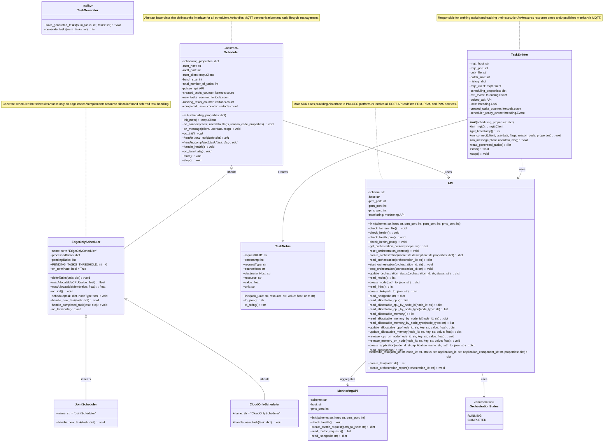

# Class Diagram for Offloading System

## Key Components Overview

### 1. **Scheduler Hierarchy**

- **Scheduler (Abstract)**: Base class defining the interface for all schedulers
- **EdgeOnlyScheduler**: Schedules tasks exclusively on edge nodes
- **JointScheduler**: Inherits from EdgeOnlyScheduler, can schedule on any node type
- **CloudOnlyScheduler**: Schedules tasks exclusively on cloud nodes

### 2. **Task Management**

- **TaskEmitter**: Manages task emission, tracks execution metrics, and handles MQTT communication
- **TaskMetric**: Data class for task performance metrics
- **TaskGenerator**: Utility functions for generating test tasks

### 3. **API Layer**

- **API**: Main SDK providing interface to PULCEO platform services
- **MonitoringAPI**: Specialized API for monitoring and metrics
- **OrchestrationStatus**: Enumeration for orchestration states

### 4. **Communication**

- MQTT-based asynchronous communication between TaskEmitter and Schedulers
- REST API communication with PULCEO platform services (PRM, PSM, PMS)

### 5. **Key Patterns**

- **Strategy Pattern**: Different scheduler implementations for different deployment strategies
- **Observer Pattern**: MQTT-based event-driven communication
- **Template Method**: Abstract methods in Scheduler base class